---
## Front matter
title: "Лабораторная работа №5"
subtitle: "Создание и процесс обработки программ на языке ассемблера NASM"
author: "Медникова Екатерина Михайловна"

## Generic otions
lang: ru-RU
toc-title: "Содержание"

## Bibliography
bibliography: bib/cite.bib
csl: pandoc/csl/gost-r-7-0-5-2008-numeric.csl

## Pdf output format
toc: true # Table of contents
toc-depth: 2
lof: true # List of figures
lot: true # List of tables
fontsize: 12pt
linestretch: 1.5
papersize: a4
documentclass: scrreprt
## I18n polyglossia
polyglossia-lang:
  name: russian
  options:
	- spelling=modern
	- babelshorthands=true
polyglossia-otherlangs:
  name: english
## I18n babel
babel-lang: russian
babel-otherlangs: english
## Fonts
mainfont: PT Serif
romanfont: PT Serif
sansfont: PT Sans
monofont: PT Mono
mainfontoptions: Ligatures=TeX
romanfontoptions: Ligatures=TeX
sansfontoptions: Ligatures=TeX,Scale=MatchLowercase
monofontoptions: Scale=MatchLowercase,Scale=0.9
## Biblatex
biblatex: true
biblio-style: "gost-numeric"
biblatexoptions:
  - parentracker=true
  - backend=biber
  - hyperref=auto
  - language=auto
  - autolang=other*
  - citestyle=gost-numeric
## Pandoc-crossref LaTeX customization
figureTitle: "Рис."
tableTitle: "Таблица"
listingTitle: "Листинг"
lofTitle: "Список иллюстраций"
lotTitle: "Список таблиц"
lolTitle: "Листинги"
## Misc options
indent: true
header-includes:
  - \usepackage{indentfirst}
  - \usepackage{float} # keep figures where there are in the text
  - \floatplacement{figure}{H} # keep figures where there are in the text
---

# Цель работы

Освоение процедуры компиляции и сборки программ, написанных на ассемблере NASM.

# Теоретическое введение

**Язык ассемблера** (assembly language, сокращённо asm) — машинно-ориентированный язык низкого уровня. Можно считать, что он больше любых других языков приближен к архитектуре ЭВМ и её аппаратным возможностям, что позволяет получить к ним более полный доступ, нежели в языках высокого уровня, таких как C/C++, Perl, Python и пр. Заметим, что получить полный доступ к ресурсам компьютера в современных архитектурах нельзя, самым низким уровнем работы прикладной программы является обращение напрямую к ядру операционной системы. Именно на этом уровне и работают программы, написанные на ассемблере. Но в отличие от языков высокого уровня ассемблерная программа содержит только тот код, который ввёл программист. Таким образом язык ассемблера — это язык, с помощью которого понятным для человека образом пишутся команды для процессора.

Следует отметить, что процессор понимает не команды ассемблера, а последовательности из нулей и единиц — **машинные коды**. До появления языков ассемблера программистам приходилось писать программы, используя только лишь машинные коды, которые были крайне сложны для запоминания, так как представляли собой числа, записанные в двоичной или шестнадцатеричной системе счисления. Преобразование или трансляция команд с языка ассемблера в исполняемый машинный код осуществляется специальной программой транслятором — **Ассемблер**.

Программы, написанные на языке ассемблера, не уступают в качестве и скорости программам, написанным на машинном языке, так как транслятор просто переводит мнемонические обозначения команд в последовательности бит (нулей и единиц).

Используемые мнемоники обычно одинаковы для всех процессоров одной архитектуры или семейства архитектур (среди широко известных — мнемоники процессоров и контроллеров x86, ARM, SPARC, PowerPC,M68k). Таким образом для каждой архитектуры существует свой ассемблер и, соответственно, свой язык ассемблера.

Наиболее распространёнными ассемблерами для архитектуры x86 являются:

• для DOS/Windows: Borland Turbo Assembler (TASM), Microsoft Macro Assembler (MASM) и Watcom assembler (WASM);

• для GNU/Linux: gas (GNU Assembler), использующий AT&T-синтаксис, в отличие от большинства других популярных ассемблеров, которые используют Intel-синтаксис.

NASM — это открытый проект ассемблера, версии которого доступны под различные операционные системы и который позволяет получать объектные файлы для этих систем. В NASM используется Intel-синтаксис и поддерживаются инструкции x86-64.

Типичный формат записи команд NASM имеет вид:

[метка:] мнемокод [операнд {, операнд}] [; комментарий]

Здесь **мнемокод** — непосредственно мнемоника инструкции процессору, которая является обязательной частью команды. **Операндами** могут быть числа, данные, адреса регистров или адреса оперативной памяти. **Метка** — это идентификатор, с которым ассемблер ассоциирует некоторое число, чаще всего адрес в памяти. Т.о. метка перед командой связана с адресом данной команды. Допустимыми символами в метках являются буквы, цифры, а также следующие символы: _, $, #, @,~,. и ?.

Начинаться метка или идентификатор могут с буквы, ., _ и ?. Перед идентификаторами, которые пишутся как зарезервированные слова, нужно писать $,
чтобы компилятор трактовал его верно (так называемое экранирование). Максимальная длина идентификатора 4095 символов.

Программа на языке ассемблера также может содержать **директивы** — инструкции, не переводящиеся непосредственно в машинные команды, а управляющие работой транслятора. Например, директивы используются для определения данных (констант и переменных) и обычно пишутся большими буквами.

# Выполнение лабораторной работы

1. Создала каталог для работы с программами на языке ассемблера NASM и перешла в него.

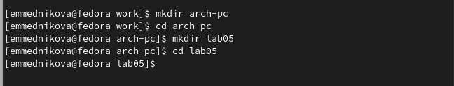{#fig:001 width=70%}

2. Создала текстовый файл с именем hello.asm. 

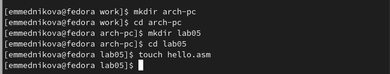{#fig:002 width=70%} 

3. Открыла файл с помощью текстового редактора gedit и ввела в него текст. 

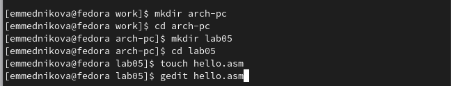{#fig:003 width=70%}

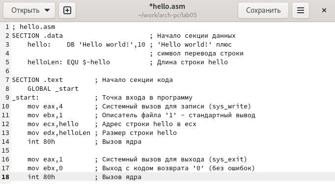{#fig:004 width=70%}

4. Провела компиляцию текста программы с помощью команды nasm -f elf hello.asm.

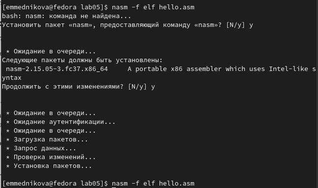{#fig:005 width=70%}

5. Скомпилировала файл с помощью команды nasm -o obj.o -f elf -g -l list.lst hello.asm. С помощью команды ls проверила, что файлы были созданы. 

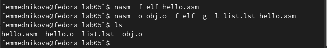{#fig:006 width=70%}

6. Передала файл на обработку компоновщику с помощью команды ld -m elf_i386 hello.o -o hello. Далее использовала команду ld -m elf_i386 obj.o -o main. Запустила на выполнение исполняемый файл с помощью команды ./hello.

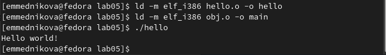{#fig:007 width=70%}

# Выполнение самостоятельной работы

1. В каталоге ~/work/arch-pc/lab05 с помощью команды cp создала копию файла hello.asm с именем lab5.asm. 

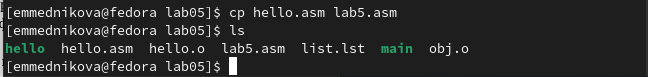{#fig:008 width=70%}

2. С помощью редактора gedit внесла изменения в текст программы в файле lab5.asm так, чтобы вместо Hello world! на экран выводилась строка с моей фамилией и моим именем.

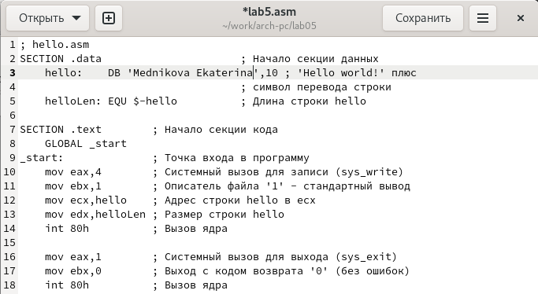{#fig:009 width=70%}

3. Оттранслировала полученный текст программы lab5.asm в объектный файл. Выполнила компоновку объектного файла и запустила получившийся исполняемый файл.

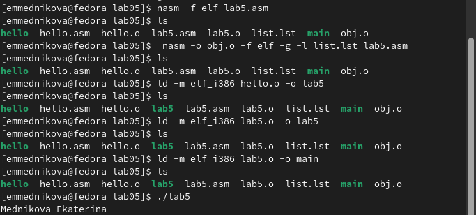{#fig:0010 width=70%}

4. Скопировала файлы hello.asm и lab5.asm в свой локальный репозиторий в каталог ~/work/study/2022-2023/"Архитектура компьютера"/arch-pc/labs/lab05/. Загрузила файлы на Github.

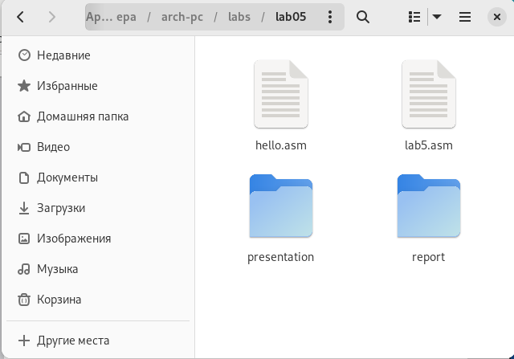{#fig:0011 width=70%}

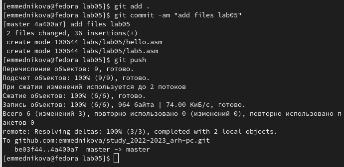{#fig:0012 width=70%}

# Выводы

Освоила процедуры компиляции и сборки программ, написанных на ассемблере NASM.

