---
## Front matter
title: "Лабораторная работа №6"
subtitle: "Основы работы Midnight Commander (mc). Структура программы на языке ассемблера NASM. Системные вызовы в OC GNU Linux"
author: "Медникова Екатерина Михайловна"

## Generic otions
lang: ru-RU
toc-title: "Содержание"

## Bibliography
bibliography: bib/cite.bib
csl: pandoc/csl/gost-r-7-0-5-2008-numeric.csl

## Pdf output format
toc: true # Table of contents
toc-depth: 2
lof: true # List of figures
lot: true # List of tables
fontsize: 12pt
linestretch: 1.5
papersize: a4
documentclass: scrreprt
## I18n polyglossia
polyglossia-lang:
  name: russian
  options:
	- spelling=modern
	- babelshorthands=true
polyglossia-otherlangs:
  name: english
## I18n babel
babel-lang: russian
babel-otherlangs: english
## Fonts
mainfont: PT Serif
romanfont: PT Serif
sansfont: PT Sans
monofont: PT Mono
mainfontoptions: Ligatures=TeX
romanfontoptions: Ligatures=TeX
sansfontoptions: Ligatures=TeX,Scale=MatchLowercase
monofontoptions: Scale=MatchLowercase,Scale=0.9
## Biblatex
biblatex: true
biblio-style: "gost-numeric"
biblatexoptions:
  - parentracker=true
  - backend=biber
  - hyperref=auto
  - language=auto
  - autolang=other*
  - citestyle=gost-numeric
## Pandoc-crossref LaTeX customization
figureTitle: "Рис."
tableTitle: "Таблица"
listingTitle: "Листинг"
lofTitle: "Список иллюстраций"
lotTitle: "Список таблиц"
lolTitle: "Листинги"
## Misc options
indent: true
header-includes:
  - \usepackage{indentfirst}
  - \usepackage{float} # keep figures where there are in the text
  - \floatplacement{figure}{H} # keep figures where there are in the text
---

# Цель работы

Приобретение практических навыков работы в Midnight Commander. Освоение инструкций языка ассемблера mov и int.

# Теоретическое введение

**Midnight Commander** (или просто mc) — это программа, которая позволяет просматривать структуру каталогов и выполнять основные операции по управлению файловой системой, т.е. mc является файловым менеджером. Midnight Commander позволяет сделать работу с файлами более удобной и наглядной. Для активации оболочки Midnight Commander достаточно ввести в командной строке mc и нажать клавишу Enter. В Midnight Commander используются функциональные клавиши F1 — F10 , к которым привязаны часто выполняемые операции. 

Следующие комбинации клавиш облегчают работу с Midnight Commander:

• Tab используется для переключениями между панелями;

• Стрелки вверх и вниз используется для навигации, Enter для входа в каталог или открытия файла (если в файле расширений mc.ext заданы правила связи определённых расширений файлов с инструментами их запуска или обработки);

• Ctrl + u (или через меню Команда > Переставить панели ) меняет местами содержимое правой и левой панелей;

• Ctrl + o (или через меню Команда > Отключить панели ) скрывает или возвращает панели Midnight Commander, за которыми доступен для работы командный интерпретатор оболочки и выводимая туда информация.

• Ctrl + x + d (или через меню Команда > Сравнить каталоги ) позволяет сравнить содержимое каталогов, отображаемых на левой и правой панелях.

Дополнительную информацию о Midnight Commander можно получить по
команде man mc и на странице проекта. 

Программа на языке ассемблера NASM, как правило, состоит из трёх секций: секция кода программы (SECTION .text), секция инициированных (известных во время компиляции) данных (SECTION .data) и секция неинициализированных данных (тех, под которые во время компиляции только отводится память, а значение присваивается в ходе выполнения программы) (SECTION .bss). 

Для объявления инициированных данных в секции .data используются директивы DB, DW, DD, DQ и DT, которые резервируют память и указывают, какие значения должны храниться в этой памяти:

• DB (define byte) — определяет переменную размером в 1 байт;

• DW (define word) — определяет переменную размеров в 2 байта (слово);

• DD (define double word) — определяет переменную размером в 4 байта (двойное слово);

• DQ (define quad word) — определяет переменную размером в 8 байт (учетверённое слово);

• DT (define ten bytes) — определяет переменную размером в 10 байт.

Директивы используются для объявления простых переменных и для объявления массивов. Для определения строк принято использовать директиву DB в связи с особенностями хранения данных в оперативной памяти.

Синтаксис директив определения данных следующий:

<имя> DB <операнд> [, <операнд>] [, <операнд>]

Для объявления неинициированных данных в секции .bss используются директивы resb, resw, resd и другие, которые сообщают ассемблеру, что необходимо зарезервировать заданное количество ячеек памяти.

Инструкция языка ассемблера mov предназначена для дублирования данных источника в приёмнике. В общем виде эта инструкция записывается в виде

mov dst,src

Здесь операнд dst — приёмник, а src — источник.

Инструкция языка ассемблера intпредназначена для вызова прерывания с указанным номером. В общем виде она записывается в виде

int n

Здесь n — номер прерывания, принадлежащий диапазону 0–255.

# Выполнение лабораторной работы

1. Открыла Midnight Commander. Пользуясь клавишами стрелок вверх, вниз и Enter перешла в каталог ~/work/arch-pc созданный при выполнении лабораторной работы №5.

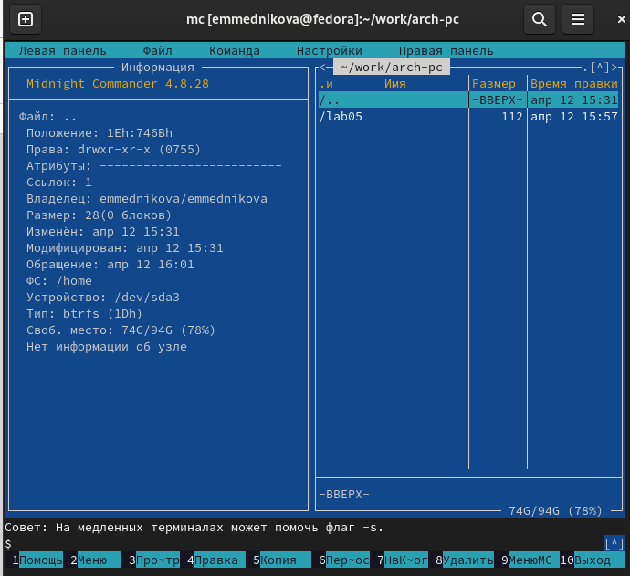{#fig:001 width=70%}

2. С помощью функциональной клавиши F7 создала папку lab06 и перешла в созданный каталог.

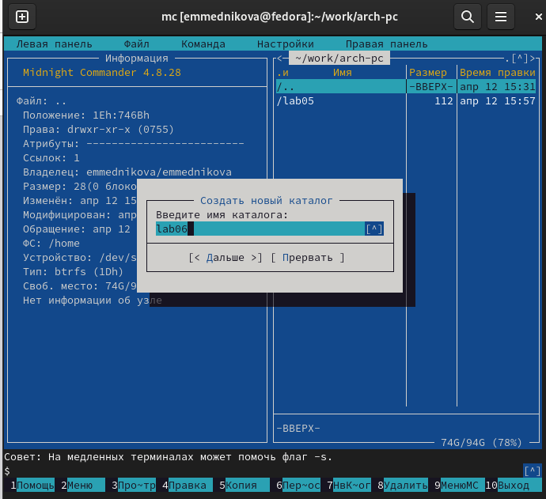{#fig:002 width=70%}

3. Пользуясь строкой ввода и командой touch создала файл lab6-1.asm. 

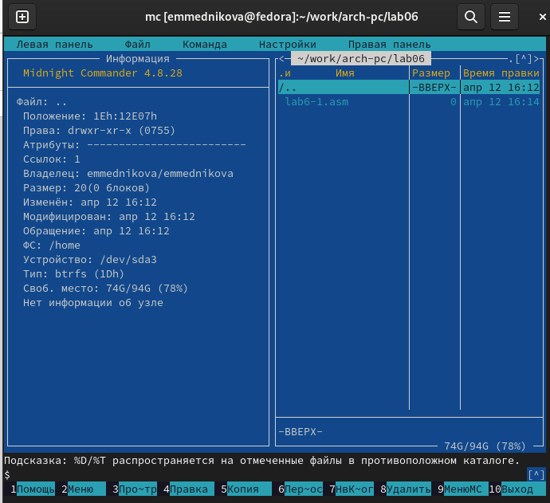{#fig:003 width=70%}

4. С помощью функциональной клавиши F4 открыла файл lab6-1.asm для редактирования во встроенном редакторе. 

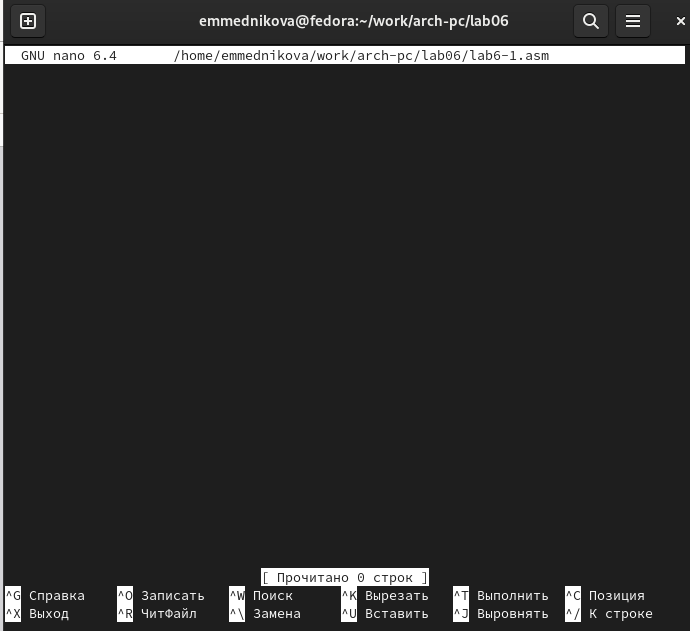{#fig:004 width=70%}

5. Ввела текст программы из листинга 6.1, сохранила изменения и закрыла файл.

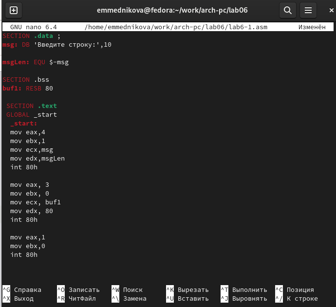{#fig:005 width=70%}

6. С помощью функциональной клавиши F3 открыла файл lab6-1.asm для просмотра. Убедилась, что файл содержит текст программы.

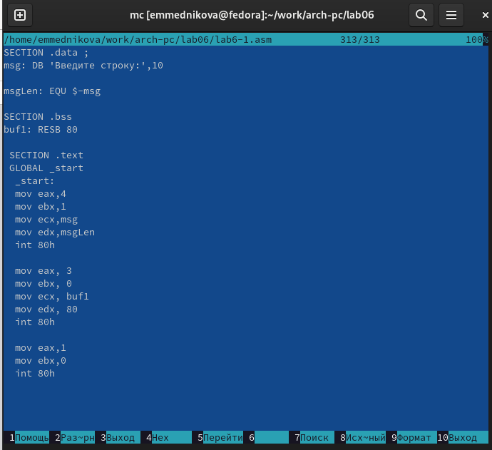{#fig:007 width=70%}

7. Оттранслировала текст программы lab6-1.asm в объектный файл. Выполнила компоновку объектного файла и запустите получившийся исполняемый файл. 

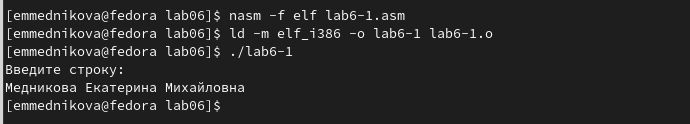{#fig:008 width=70%}

8. Скачала файл in_out.asm со страницы ТУИС. 

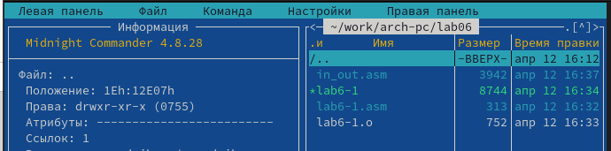{#fig:009 width=70%}

9. В одной из панелей mc открыла каталог с файлом lab6-1.asm. В другой панели каталог со скаченным файлом in_out.asm. Скопировала файл in_out.asm в каталог с файлом lab6-1.asm с помощью функциональной клавиши F5.

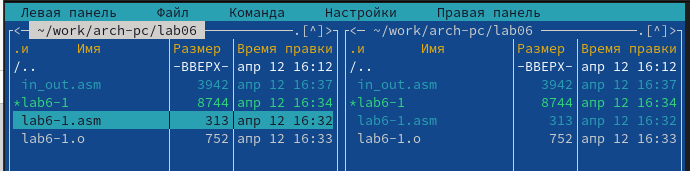{#fig:0010 width=70%}

10. С помощью функциональной клавиши F6 создала копию файла lab6-1.asm с именем lab6-2.asm. Выделила файл lab6-1.asm, нажала клавишу F6 , ввела имя файла lab6-2.asm и нажала клавишу Enter.

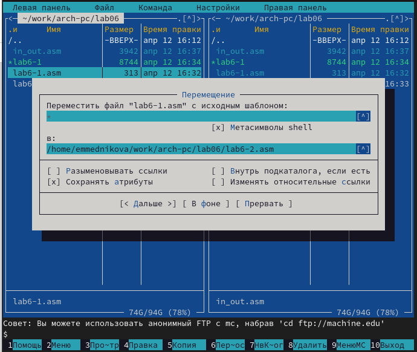{#fig:0011 width=70%}

11. Исправила текст программы в файле lab6-2.asm с использование подпрограмм из внешнего файла in_out.asm в соответствии с листингом 6.2. Создала исполняемый файл и проверила его работу.

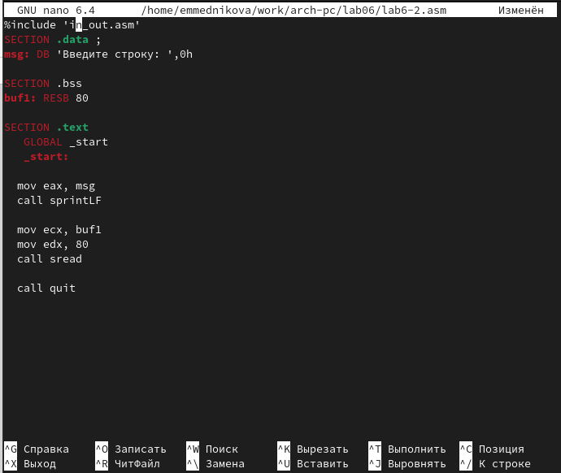{#fig:0012 width=70%}

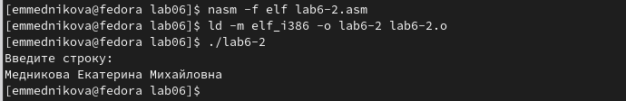{#fig:0013 width=70%}

12. В файле lab6-2.asm заменила подпрограмму sprintLF на sprint. Создала исполняемый файл и проверила его работу.

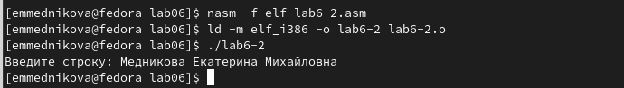{#fig:0014 width=70%}

# Самостоятельная работа

1. Создала копию файла lab6-1.asm. Внесла изменения в программу (без использования внешнего файла in_out.asm), так чтобы она работала по алгоритму, прописанному в задании. 

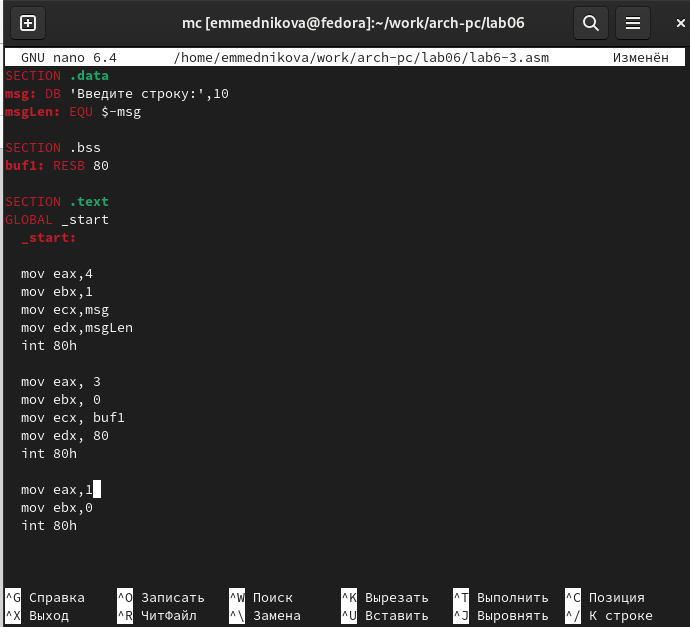{#fig:0015 width=70%}

2. Получила исполняемый файл и проверила его работу. На приглашение ввести строку ввела свои ФИ0.

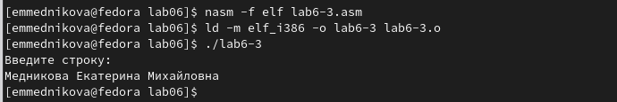{#fig:0016 width=70%}

3. Создала копию файла lab6-2.asm. Исправила текст программы с использованием подпрограмм из внешнего файла in_out.asm, так чтобы она работала по алгоритму, прописанному в задании. 

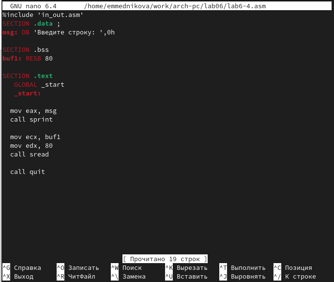{#fig:0017 width=70%}

4. Создала исполняемый файл и проверила его работу.

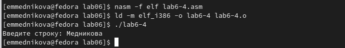{#fig:0018 width=70%}

# Выводы

Приобрела практические навыки работы в Midnight Commander. Освоила инструкции языка ассемблера mov и int.

