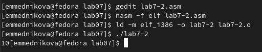

---
## Front matter
title: "Лабораторная работа №7"
subtitle: "Арифметические операции в NASM"
author: "Медникова Екатерина Михайловна"

## Generic otions
lang: ru-RU
toc-title: "Содержание"

## Bibliography
bibliography: bib/cite.bib
csl: pandoc/csl/gost-r-7-0-5-2008-numeric.csl

## Pdf output format
toc: true # Table of contents
toc-depth: 2
lof: true # List of figures
lot: true # List of tables
fontsize: 12pt
linestretch: 1.5
papersize: a4
documentclass: scrreprt
## I18n polyglossia
polyglossia-lang:
  name: russian
  options:
	- spelling=modern
	- babelshorthands=true
polyglossia-otherlangs:
  name: english
## I18n babel
babel-lang: russian
babel-otherlangs: english
## Fonts
mainfont: PT Serif
romanfont: PT Serif
sansfont: PT Sans
monofont: PT Mono
mainfontoptions: Ligatures=TeX
romanfontoptions: Ligatures=TeX
sansfontoptions: Ligatures=TeX,Scale=MatchLowercase
monofontoptions: Scale=MatchLowercase,Scale=0.9
## Biblatex
biblatex: true
biblio-style: "gost-numeric"
biblatexoptions:
  - parentracker=true
  - backend=biber
  - hyperref=auto
  - language=auto
  - autolang=other*
  - citestyle=gost-numeric
## Pandoc-crossref LaTeX customization
figureTitle: "Рис."
tableTitle: "Таблица"
listingTitle: "Листинг"
lofTitle: "Список иллюстраций"
lotTitle: "Список таблиц"
lolTitle: "Листинги"
## Misc options
indent: true
header-includes:
  - \usepackage{indentfirst}
  - \usepackage{float} # keep figures where there are in the text
  - \floatplacement{figure}{H} # keep figures where there are in the text
---

# Цель работы

Освоение арифметических инструкций языка ассемблера NASM.

# Теоретическое введение

Микропроцессор может выполнять целочисленные операциии и операции с плавающей точкой. Для этого в его архитектуре есть два отдельных блока:
	
	устройство для выполнения целочисленных операций;
	
	устройство с плавающей точкой.
	
Каждое из этих устройств имеет свою систему команд. Целочисленное устройство может взять на себя многие функции устройства с плавающей точкой, но это потребует больших вычислительных затрат.
Для большинства задач, использующих язык ассемблера, достаточно целочисленной арифметики. 

# Выполнение лабораторной работы

1. Создала каталог и файл.

{#fig:001 width=70%}

{#fig:002 width=70%}

{#fig:003 width=70%}

2. Ввела в файл текст программы из листинга 7.1. Создала исполняемый файл и запустила его. 

{#fig:004 width=70%}

{#fig:005 width=70%}

3. Изменила в файле текст программы, как было указано в лабораторной работе. Создала исполняемый файл и запустила его.

{#fig:006 width=70%}

{#fig:007 width=70%}

4. Создала файл lab7-2.asm и ввела в него текст программы из листинга 7.2. Создала исполняемый файл и запустила его.

{#fig:008 width=70%}

{#fig:009 width=70%}

{#fig:0010 width=70%}

5. Изменила символы на числа. Создала исполняемый файл и запустила его. При исполнении программы результат получился 10.

{#fig:0011 width=70%}

{#fig:0012 width=70%}

6. Заменила функцию iprintLF на iprint. Создала исполняемый файл и запустила его. При iprint числа вводятся в формате ASCII. Функция iprintLF работает аналогично, но при выводе на экран после числа добавляет к символу перевод строки.

{#fig:0013 width=70%}

{#fig:0014 width=70%}

7. Создала файл lab7-3.asm. Ввела в него текст программы из листинга 7.3. 

{#fig:0015 width=70%}

{#fig:0016 width=70%}

8. Изменила текст программы для вычисления выражения. Создала исполняемый файл и проверила его работу.

{#fig:0017 width=70%}

{#fig:0018 width=70%}

9. Создала файл variant.asm. Ввела в него текст программы из листинга 7.4. Создала исполняемый файл и запустила его. 

{#fig:0019 width=70%}

{#fig:0020 width=70%}

{#fig:0021 width=70%}

# Ответы на вопросы

1. За вывод на экран сообщения ‘Ваш вариант:’ отвечают строки mov eax, rem call sprint.

2. nasm mov ecx - записывает адрес выводимого сообщения в eax;

mov edx, 80 - записывает длину вводимого сообщения в ebx;

call sread - выполняет вызов программы ввода сообщения.

3. Инструкция 'call atoi' используется для преобразования символа в число.

4. За вычисление варинта отвечают строки: xor edx, edx mov ebx,20 div ebx inc edx.

5. Остаток от деления записывается в регистр ebx.

6. Инструкция 'inc edx' используется для увеличения значения edx на единицу.

7. За вывод на экран результата вычислений отвечают строки: mov eax, edx call iprintLF

# Самостоятельная работа 

1. Перед началом работы создала файл. Написала программу для вычисления выражения из варианта 10, который был получен ранее при выполнении лабораторной работы.

{#fig:0022 width=70%}

{#fig:0023 width=70%}

{#fig:0024 width=70%}

# Выводы

Освоила арифметические инструкции языка ассемблера NASM.

