---
## Front matter
title: "Лабораторная работа №8"
subtitle: "Команды безусловного и условного переходов в Nasm. Программирование ветвлений"
author: "Медникова Екатерина Михайловна"

## Generic otions
lang: ru-RU
toc-title: "Содержание"

## Bibliography
bibliography: bib/cite.bib
csl: pandoc/csl/gost-r-7-0-5-2008-numeric.csl

## Pdf output format
toc: true # Table of contents
toc-depth: 2
lof: true # List of figures
lot: true # List of tables
fontsize: 12pt
linestretch: 1.5
papersize: a4
documentclass: scrreprt
## I18n polyglossia
polyglossia-lang:
  name: russian
  options:
	- spelling=modern
	- babelshorthands=true
polyglossia-otherlangs:
  name: english
## I18n babel
babel-lang: russian
babel-otherlangs: english
## Fonts
mainfont: PT Serif
romanfont: PT Serif
sansfont: PT Sans
monofont: PT Mono
mainfontoptions: Ligatures=TeX
romanfontoptions: Ligatures=TeX
sansfontoptions: Ligatures=TeX,Scale=MatchLowercase
monofontoptions: Scale=MatchLowercase,Scale=0.9
## Biblatex
biblatex: true
biblio-style: "gost-numeric"
biblatexoptions:
  - parentracker=true
  - backend=biber
  - hyperref=auto
  - language=auto
  - autolang=other*
  - citestyle=gost-numeric
## Pandoc-crossref LaTeX customization
figureTitle: "Рис."
tableTitle: "Таблица"
listingTitle: "Листинг"
lofTitle: "Список иллюстраций"
lotTitle: "Список таблиц"
lolTitle: "Листинги"
## Misc options
indent: true
header-includes:
  - \usepackage{indentfirst}
  - \usepackage{float} # keep figures where there are in the text
  - \floatplacement{figure}{H} # keep figures where there are in the text
---

# Цель работы

Изучение команд условного и безусловного переходов. Приобретение навыков написания программ с использованием переходов. Знакомство с назначением и структурой файла листинга.

# Теоретическое введение

Для реализации ветвлений в ассемблере используются так называемые команды передачи управления или команды перехода. Можно выделить 2 типа переходов:

• условный переход – выполнение или не выполнение перехода в определенную точку программы в зависимости от проверки условия.

• безусловный переход – выполнение передачи управления в определенную точку программы без каких-либо условий.

Безусловный переход выполняется инструкцией jmp (от англ. jump – прыжок), которая включает в себя адрес перехода, куда следует передать управление:

jmp <адрес_перехода>

Адрес перехода может быть либо меткой, либо адресом области памяти, в которую предварительно помещен указатель перехода. Кроме того, в качестве операнда можно использовать имя регистра, в таком случае переход будет осуществляться по адресу, хранящемуся в этом регистре.

Как отмечалось выше, для условного перехода необходима проверка какого-либо условия. В ассемблере команды условного перехода вычисляют условие перехода анализируя флаги из регистра флагов.

Флаг – это бит, принимающий значение 1 («флаг установлен»), если выполнено некоторое условие, и значение 0 («флаг сброшен») в противном случае. Флаги работают независимо друг от друга, и лишь для удобства они помещены в единый регистр — регистр флагов, отражающий текущее состояние процессора.

# Выполнение лабораторной работы

1. Создала каталог для программам лабораторной работы No 8, перешла в него и создала файл lab8-1.asm:

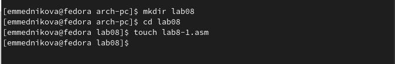{#fig:001 width=70%}

2. Ввела в файл lab8-1.asm текст программы из листинга 8.1.

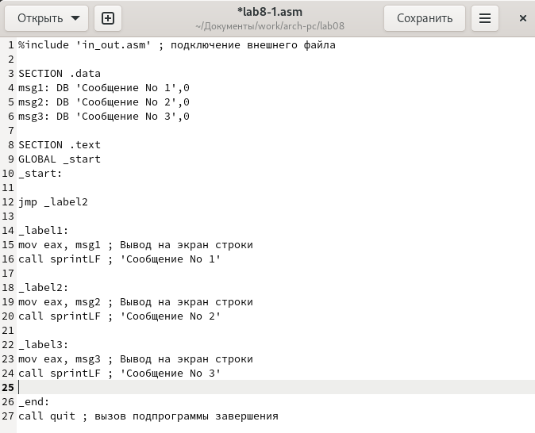{#fig:002 width=70%}

Создала исполняемый файл и запустила его. 

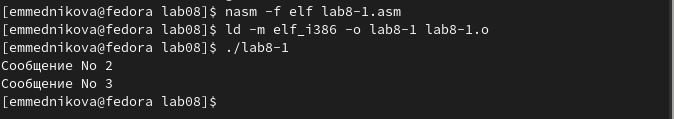{#fig:003 width=70%}

Изменила текст программы в соответствии с листингом 8.2.

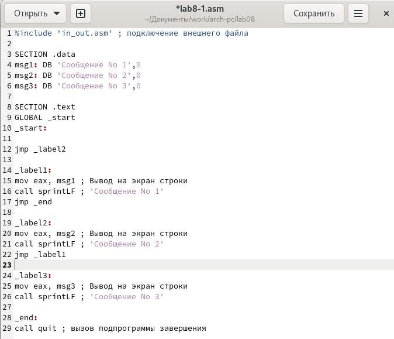{#fig:004 width=70%}

Создала исполняемый файл и проверила его работу.

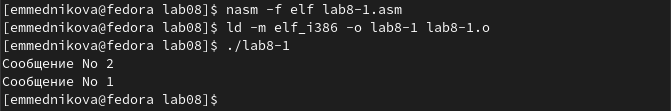{#fig:005 width=70%}

Изменила текст программы так, чтобы её вывод соответствовал инструкции, прописанной в лабораторной работе.

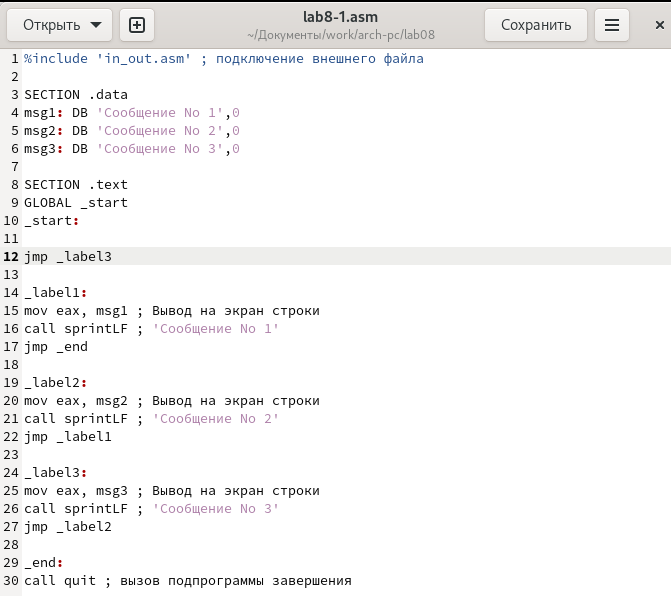{#fig:006 width=70%}

Создала исполняемый файл и проверила его работу.

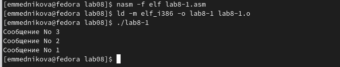{#fig:007 width=70%}

3. Создала файл lab8-2.asm в каталоге ~/work/arch-pc/lab08. 

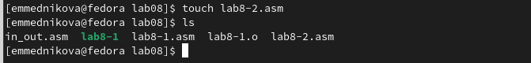{#fig:008 width=70%}

Ввела в созданный файл текст программы из листинга 8.3.

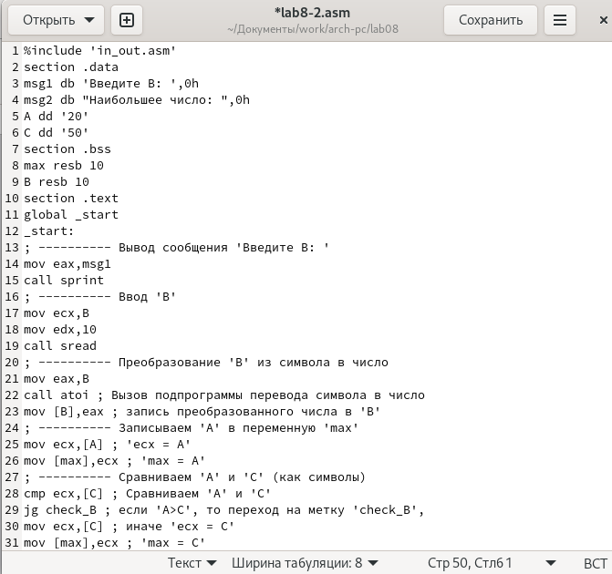{#fig:009 width=70%}

Создала исполняемый файл и проверила его работу.

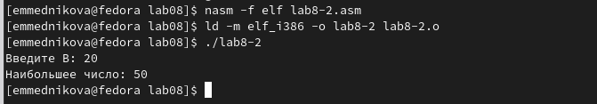{#fig:0010 width=70%}

4. Создала файл листинга для программы из файла lab8-2.asm. Открыла файл листинга lab8-2.lst с помощью текстового редактора mcedit.

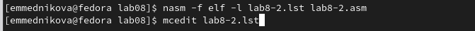{#fig:0011 width=70%}

27 строка. Адрес 00000012. Машинный код 50. Push eax (исходный текст программы) выделяет место наверху стека и помещает туда значение из регистра eax.

{#fig:0013 width=70%}

55 строка. Адрес 00000040. Машинный код 58. Pop eax (исходный текст программы) переносит любые данные из верхней части стека в eax и освобождает эту область памяти. 

{#fig:0014 width=70%}

95 строка. Адрес 00000073. Машинный код 49. Dec eсx (исходный текст программы) уменьшает значение ecx на единицу. 

{#fig:0015 width=70%}

Открыла файл с программой lab8-2.asm и удалила один операнд - max. 

{#fig:0016 width=70%}

Выполнила трансляцию с получением файла листинга. Выдалась ошибка. 

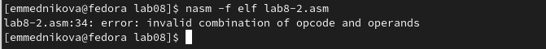{#fig:0017 width=70%}

# Выводы

Изучила команды условного и безусловного переходов. Приобрела навыки написания программ с использованием переходов. Познакомилась с назначением и структурой файла листинга.

