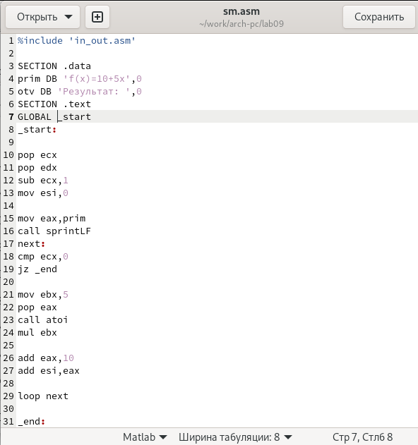

---
## Front matter
title: "Лабораторная работа №9"
subtitle: "Программирование цикла. Обработка аргументов командной строки"
author: "Медникова Екатерина Михайловна"

## Generic otions
lang: ru-RU
toc-title: "Содержание"

## Bibliography
bibliography: bib/cite.bib
csl: pandoc/csl/gost-r-7-0-5-2008-numeric.csl

## Pdf output format
toc: true # Table of contents
toc-depth: 2
lof: true # List of figures
lot: true # List of tables
fontsize: 12pt
linestretch: 1.5
papersize: a4
documentclass: scrreprt
## I18n polyglossia
polyglossia-lang:
  name: russian
  options:
	- spelling=modern
	- babelshorthands=true
polyglossia-otherlangs:
  name: english
## I18n babel
babel-lang: russian
babel-otherlangs: english
## Fonts
mainfont: PT Serif
romanfont: PT Serif
sansfont: PT Sans
monofont: PT Mono
mainfontoptions: Ligatures=TeX
romanfontoptions: Ligatures=TeX
sansfontoptions: Ligatures=TeX,Scale=MatchLowercase
monofontoptions: Scale=MatchLowercase,Scale=0.9
## Biblatex
biblatex: true
biblio-style: "gost-numeric"
biblatexoptions:
  - parentracker=true
  - backend=biber
  - hyperref=auto
  - language=auto
  - autolang=other*
  - citestyle=gost-numeric
## Pandoc-crossref LaTeX customization
figureTitle: "Рис."
tableTitle: "Таблица"
listingTitle: "Листинг"
lofTitle: "Список иллюстраций"
lotTitle: "Список таблиц"
lolTitle: "Листинги"
## Misc options
indent: true
header-includes:
  - \usepackage{indentfirst}
  - \usepackage{float} # keep figures where there are in the text
  - \floatplacement{figure}{H} # keep figures where there are in the text
---

# Цель работы

Приобретение навыков написания программ с использованием циклов и обработкой аргументов командной строки.

# Теоретическое введение

Стек — это структура данных, организованная по принципу LIFO («Last In — First Out» или «последним пришёл — первым ушёл»). Стек является частью архитектуры процессора и реализован на аппаратном уровне. Для работы со стеком в процессоре есть специальные регистры (ss, bp, sp) и команды.

Основной функцией стека является функция сохранения адресов возврата и передачи аргументов при вызове процедур. Кроме того, в нём выделяется память для локальных переменных и могут временно храниться значения регистров.

Стек имеет вершину, адрес последнего добавленного элемента, который хранится в регистре esp (указатель стека). Противоположный конец стека называется дном. Значение, помещённое в стек последним, извлекается первым. При помещении значения в стек указатель стека уменьшается, а при извлечении — увеличивается.

# Выполнение лабораторной работы

1. Создала каталог для программам лабораторной работы No 9, перешла в него и создала файл lab9-1.asm.

{#fig:001 width=70%}

2. Ввела в файл lab9-1.asm текст программы из листинга 9.1. Создала исполняемый файл и проверила его работу.

{#fig:002 width=70%}

{#fig:003 width=70%}

3. Изменила текст программы, добавив изменение значения регистра ecx в цикле. При попытке создать исполняемый файл и проверить его работу, цикл получился бесконечным. 

{#fig:004 width=70%}

{#fig:005 width=70%}

Внесла изменения в текст программы, добавив команды push и pop (добавления в стек и извлечения из стека) для сохранения значения счетчика цикла loop.

{#fig:006 width=70%}

Создала исполняемый файл и проверила его работу.

{#fig:007 width=70%}

4. Создала файл lab9-2.asm в каталоге ~/work/arch-pc/lab09 и ввела в него текст программы из листинга 9.2.

{#fig:008 width=70%}

{#fig:009 width=70%}

Создала исполняемый файл и запустила его, указав аргументы. Программа вывела все три аргумента, но в разном порядке.

{#fig:0010 width=70%}

5. Создала файл lab9-3.asm в каталоге ~/work/arch-pc/lab09 и ввела в него текст программы из листинга 9.3.

{#fig:0011 width=70%}

{#fig:0012 width=70%}

Создала исполняемый файл и запустила его, указав аргументы.

{#fig:0013 width=70%}

6. Изменила текст программы из листинга 9.3 для вычисления произведения аргументов командной строки.

{#fig:0014 width=70%}

Создала исполняемый файл и проверила его работу.

{#fig:0015 width=70%}

# Самостоятельная работа

1. Создала файл для самостоятельной работы.

{#fig:0016 width=70%}

2. Написала в созданный файл текст программы.

{#fig:0017 width=70%}

{#fig:0018 width=70%}

3. Создала исполняемый файл и проверила его работу.

{#fig:0019 width=70%}

# Выводы

Приобрела навыки написания программ с использованием циклов и обработкой аргументов командной строки.

