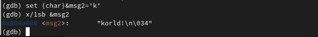
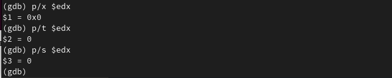
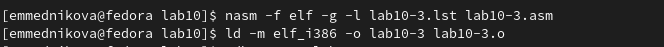

---
## Front matter
title: "Лабораторная работа №10"
subtitle: "Понятие подпрограммы. Отладчик GDB"
author: "Медникова Екатерина Михайловна"

## Generic otions
lang: ru-RU
toc-title: "Содержание"

## Bibliography
bibliography: bib/cite.bib
csl: pandoc/csl/gost-r-7-0-5-2008-numeric.csl

## Pdf output format
toc: true # Table of contents
toc-depth: 2
lof: true # List of figures
lot: true # List of tables
fontsize: 12pt
linestretch: 1.5
papersize: a4
documentclass: scrreprt
## I18n polyglossia
polyglossia-lang:
  name: russian
  options:
	- spelling=modern
	- babelshorthands=true
polyglossia-otherlangs:
  name: english
## I18n babel
babel-lang: russian
babel-otherlangs: english
## Fonts
mainfont: PT Serif
romanfont: PT Serif
sansfont: PT Sans
monofont: PT Mono
mainfontoptions: Ligatures=TeX
romanfontoptions: Ligatures=TeX
sansfontoptions: Ligatures=TeX,Scale=MatchLowercase
monofontoptions: Scale=MatchLowercase,Scale=0.9
## Biblatex
biblatex: true
biblio-style: "gost-numeric"
biblatexoptions:
  - parentracker=true
  - backend=biber
  - hyperref=auto
  - language=auto
  - autolang=other*
  - citestyle=gost-numeric
## Pandoc-crossref LaTeX customization
figureTitle: "Рис."
tableTitle: "Таблица"
listingTitle: "Листинг"
lofTitle: "Список иллюстраций"
lotTitle: "Список таблиц"
lolTitle: "Листинги"
## Misc options
indent: true
header-includes:
  - \usepackage{indentfirst}
  - \usepackage{float} # keep figures where there are in the text
  - \floatplacement{figure}{H} # keep figures where there are in the text
---

# Цель работы

Приобретение навыков написания программ с использованием подпрограмм. Знакомство с методами отладки при помощи GDB и его основными возможностями.

# Теоретическое введение

**Отладка** — это процесс поиска и исправления ошибок в программе. В общем случае его можно разделить на четыре этапа:

• обнаружение ошибки;

• поиск её местонахождения;

• определение причины ошибки;

• исправление ошибки.

Можно выделить следующие типы ошибок:

• *синтаксические ошибки* — обнаруживаются во время трансляции исходного кода и вызваны нарушением ожидаемой формы или структуры языка;

• *семантические ошибки* — являются логическими и приводят к тому, что программа запускается, отрабатывает, но не даёт желаемого результата;

• *ошибки в процессе выполнения* — не обнаруживаются при трансляции и вызывают прерывание выполнения программы (например, это ошибки, связанные с переполнением или делением на ноль).

Второй этап — поиск местонахождения ошибки. Некоторые ошибки обнаружить довольно трудно. Лучший способ найти место в программе, где находится ошибка, это разбить программу на части и произвести их отладку отдельно друг от друга.

Третий этап — выяснение причины ошибки. После определения местонахождения ошибки обычно проще определить причину неправильной работы программы.

Последний этап — исправление ошибки. После этого при повторном запуске программы, может обнаружиться следующая ошибка, и процесс отладки начнётся заново.

Наиболее часто применяют следующие методы отладки:

• создание точек контроля значений на входе и выходе участка программы (например, вывод промежуточных значений на экран — так называемые диагностические сообщения);

• использование специальных программ-отладчиков.

Отладчики позволяют управлять ходом выполнения программы, контролировать и изменять данные. Это помогает быстрее найти место ошибки в программе и ускорить её исправление. Наиболее популярные способы работы с отладчиком — это использование точек останова и выполнение программы по шагам.

Пошаговое выполнение — это выполнение программы с остановкой после каждой строчки, чтобы программист мог проверить значения переменных и выполнить другие действия.

**Точки останова** — это специально отмеченные места в программе, в которых программа-отладчик приостанавливает выполнение программы и ждёт команд.

Наиболее популярные виды точек останова:

• *Breakpoint* — точка останова (остановка происходит, когда выполнение доходит до определённой строки, адреса или процедуры, отмеченной программистом);

• *Watchpoint* — точка просмотра (выполнение программы приостанавливается, если программа обратилась к определённой переменной: либо считала её значение, либо изменила его).

Точки останова устанавливаются в отладчике на время сеанса работы с кодом программы, т.е. они сохраняются до выхода из программы-отладчика или до смены отлаживаемой программы.

# Выполнение лабораторной работы

1. Создала каталог для выполнения лабораторной работы No 10, перешла в него и создала файл lab10-1.asm.

{#fig:001 width=70%}

2. Ввела в файл lab10-1.asm текст программы из листинга 10.1.

{#fig:002 width=70%}

Создала исполняемый файл и проверила его работу. В результате программа не заработала, так как не распознаёт 'res' и 'rez'. 

{#fig:003 width=70%}

Изменила текст программы, добавив подпрограмму _subcalcul в подпрограмму _calcul.

{#fig:004 width=70%}

{#fig:005 width=70%}

При попытке создать исполняемый файл и проверить его работу, выдавалась та же самая ошибка, что и на рис. 3.3. 

3. Создала файл lab10-2.asm с текстом программы из Листинга 10.2. (Программа печати сообщения Hello world!)

{#fig:006 width=70%}

{#fig:007 width=70%}

Получила исполняемый файл. Для работы с GDB в исполняемый файл необходимо добавить отладочную информацию, для этого трансляцию программ необходимо проводить с ключом ‘-g’. Загрузила исполняемый файл в отладчик gdb.

{#fig:008 width=70%}

Проверила работу программы, запустив ее в оболочке GDB с помощью команды run.

{#fig:009 width=70%}

Для более подробного анализа программы установила брейкпоинт на метку _start, с которой начинается выполнение любой ассемблерной программы, и запустила её.

{#fig:0010 width=70%}

Посмотрела дисассимилированный код программы с помощью команды disassemble начиная с метки _start.

{#fig:0011 width=70%}

Переключилась на отображение команд с Intel’овским синтаксисом, введя команду set disassembly-flavor intel.

{#fig:0012 width=70%}

Различия отображения синтаксиса машинных команд в режимах ATT и Intel: В коде Intel отсутствуют суффиксы обозначения размера; опускается символ % перед именами регистров; имеет другой способ описания местоположений в памяти. 

Включила режим псевдографики для более удобного анализа программы.

{#fig:0013 width=70%}

4. На предыдущих шагах была установлена точка останова по имени метки (_start). Проверила это с помощью команды info breakpoints.

{#fig:0014 width=70%}

Определила адрес предпоследней инструкции (mov ebx,0x0) и установила точку останова.

{#fig:0015 width=70%}

Посмотрела информацию о всех установленных точках останова.

{#fig:0016 width=70%}

5. Посмотрела содержимое регистров с помощью команды info registers.

{#fig:0017 width=70%}

Посмотрела значение переменной msg1 по имени.

{#fig:0018 width=70%}

Посмотрела значение переменной msg2 по адресу.

{#fig:0019 width=70%}

Изменила первый символ переменной msg1.

{#fig:0020 width=70%}

Заменила символ во второй переменной msg2.

{#fig:0021 width=70%}

Вывела в в шестнадцатеричном, в двоичном формате и в символьном виде значение регистра edx.

{#fig:0022 width=70%}

С помощью команды set изменила значение регистра ebx.

{#fig:0023 width=70%}

6. Скопировала файл lab9-2.asm, созданный при выполнении лабораторной работы No9, с программой, выводящей на экран аргументы командной строки (Листинг 9.2) в файл с именем lab10-3.asm.

{#fig:0024 width=70%}

Создала исполняемый файл.

{#fig:0025 width=70%}

Загрузила исполняемый файл в отладчик, указав аргументы.

{#fig:0026 width=70%}

Установила точку останова перед первой инструкцией в программе и запустила ее.

{#fig:0027 width=70%}

Адрес вершины стека хранится в регистре esp, и по этому адресу располагается число, равное количеству аргументов командной строки (включая имя программы).

{#fig:0028 width=70%}

Посмотрела остальные позиции стека – по адесу [esp+4] располагается адрес в памяти, где находится имя программы, по адесу [esp+8] хранится адрес первого аргумента, по аресу [esp+12] – второго и т.д.

{#fig:0029 width=70%}

# Самостоятельная работа

1. Преобразовала программу из лабораторной работы No9 (Задание No1 для
самостоятельной работы), реализовав вычисление значения функции как подпрограмму.

{#fig:0030 width=70%}

{#fig:0031 width=70%}

2. С помощью отладчика GDB, анализируя изменения значений регистров, определила ошибку программы и исправила ее.

{#fig:0032 width=70%}

{#fig:0033 width=70%}

# Выводы

Приобрела навыки написания программ с использованием подпрограмм. Познакомилась с методами отладки при помощи GDB и его основными возможностями.

