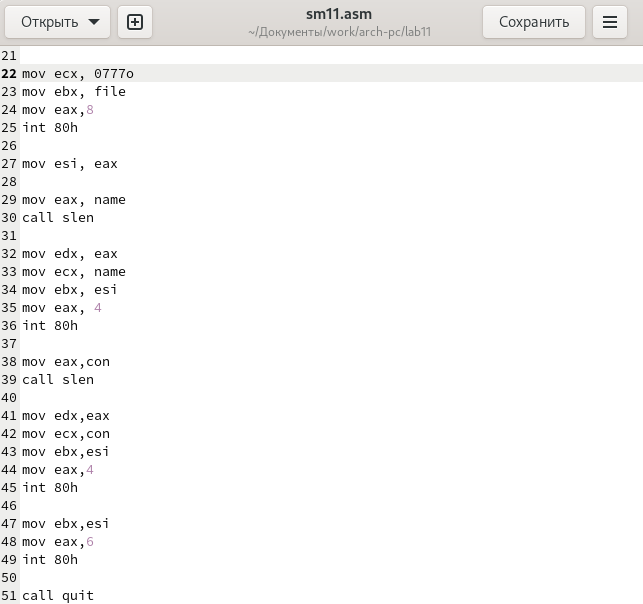

---
## Front matter
title: "Лабораторная работа №11"
subtitle: "Работа с файлами средствами NASM"
author: "Медникова Екатерина Михайловна"

## Generic otions
lang: ru-RU
toc-title: "Содержание"

## Bibliography
bibliography: bib/cite.bib
csl: pandoc/csl/gost-r-7-0-5-2008-numeric.csl

## Pdf output format
toc: true # Table of contents
toc-depth: 2
lof: true # List of figures
lot: true # List of tables
fontsize: 12pt
linestretch: 1.5
papersize: a4
documentclass: scrreprt
## I18n polyglossia
polyglossia-lang:
  name: russian
  options:
	- spelling=modern
	- babelshorthands=true
polyglossia-otherlangs:
  name: english
## I18n babel
babel-lang: russian
babel-otherlangs: english
## Fonts
mainfont: PT Serif
romanfont: PT Serif
sansfont: PT Sans
monofont: PT Mono
mainfontoptions: Ligatures=TeX
romanfontoptions: Ligatures=TeX
sansfontoptions: Ligatures=TeX,Scale=MatchLowercase
monofontoptions: Scale=MatchLowercase,Scale=0.9
## Biblatex
biblatex: true
biblio-style: "gost-numeric"
biblatexoptions:
  - parentracker=true
  - backend=biber
  - hyperref=auto
  - language=auto
  - autolang=other*
  - citestyle=gost-numeric
## Pandoc-crossref LaTeX customization
figureTitle: "Рис."
tableTitle: "Таблица"
listingTitle: "Листинг"
lofTitle: "Список иллюстраций"
lotTitle: "Список таблиц"
lolTitle: "Листинги"
## Misc options
indent: true
header-includes:
  - \usepackage{indentfirst}
  - \usepackage{float} # keep figures where there are in the text
  - \floatplacement{figure}{H} # keep figures where there are in the text
---

# Цель работы

Приобретение навыков написания программ для работы с файлами.

# Теоретическое введение

Права доступа выполняют три действия: чтение, запись и исполнение. Эти права могут быть предоставлены трём видам пользователей: владельцу файла (пользователю), группе-владельцу файла и всем пользователям, которые не входят в эту группу.

# Выполнение лабораторной работы

1. Создала каталог для программ лабораторной работы №11, перешла в него и создала два файла.

{#fig:001 width=70%}

2. Ввела в файл текст программы из листинга 11.1. Создала исполняемый файл и проверила его работу.

{#fig:002 width=70%}

{#fig:003 width=70%}

3. С помощью команды chmod изменила права доступа к исполняемому файлу, запретив его выполнение. Попыталась выполнить файл. В результате было отказано в доступе в связи с тем, что я запретила запуск программы владельцу. 

{#fig:004 width=70%}

4. С помощью команды chmod изменила права доступа к файлу с исходным текстом программы, добавив права на исполнение. Попыталась выполнить его. Программа заработала, так как у файла были все разрешения.

{#fig:005 width=70%}

5. Предоставила права доступа к файлу readme.txt в соответствии с вариантом в таблице 11.4 (мой вариант 10). Проверила правильность выполнения с помощью команды ls -l.

{#fig:006 width=70%}

# Самостоятельная работа

1. Написала программу, работающую по алгоритму, прописанному в задании к самостоятельной работе.

{#fig:007 width=70%}

{#fig:008 width=70%}

{#fig:009 width=70%}

{#fig:0010 width=70%}

# Выводы

Приобрела навыки написания программ для работы с файлами.

